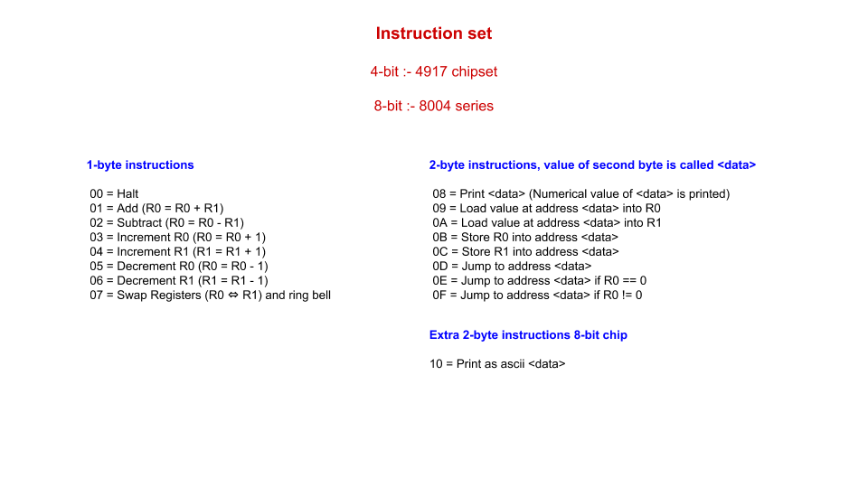
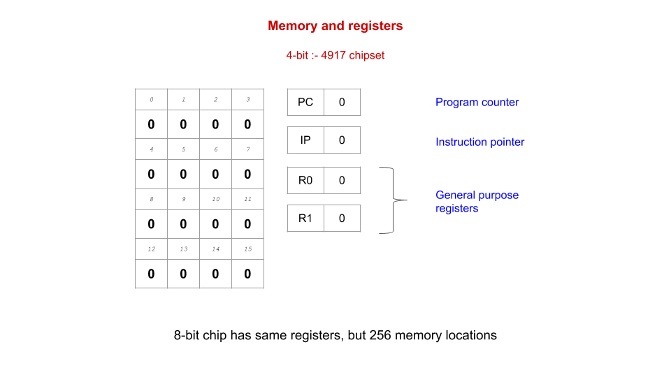

# Emulator for 4-bit and 8-bit chips

## Features

* Interactive shell

* Simple debugger

* Run program from a file

* Own assembly langauge

* Simple assembler

## Details

## Assembly language ➔ instruction code

* HALT ➔ 00

* ADD ➔ 01

* SUB ➔ 02

* INC0 ➔ 03

* INC1 ➔ 04

* DEC0 ➔ 05

* DEC1 ➔ 06

* SWP ➔ 07

* PRNT ➔ 08

* LD0 ➔ 09

* LD1 ➔ 0A

* ST0 ➔ 0B

* ST1 ➔ 0C

* JMP ➔ 0D

* JMPZ ➔ 0E

* JMPNZ ➔ 0F

* ASCCHAR ➔ 10
